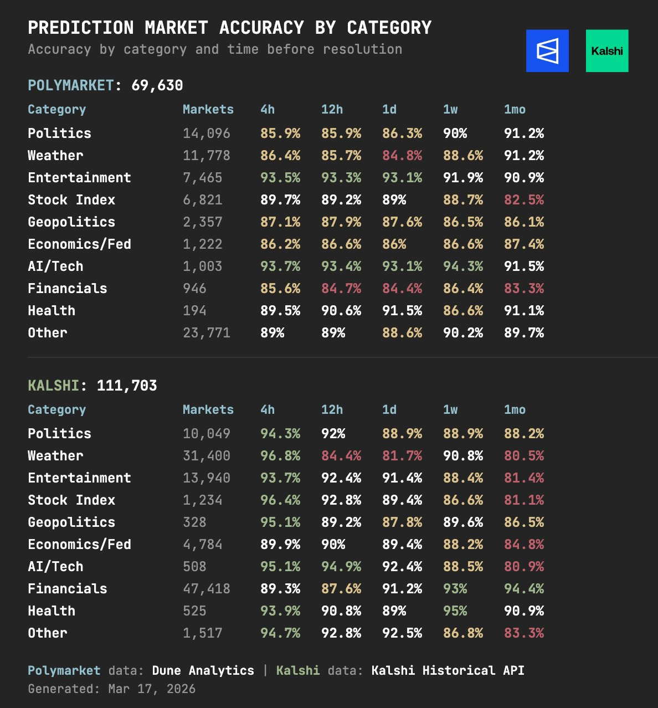

While the world is obsessed with Large Language Models (LLMs) and the quest for AGI, there is a powerful form of "Machine Learning" that has been operating in plain sight for decades. It doesn't run on GPUs, it has no transformer architecture, and its "weights" are adjusted not by backpropagation, but by the financial survival of its participants.

This is **Crowdsourced Machine Learning (CSML)** via prediction markets.

### 1. The Loss Function: Your Bank Account

In traditional machine learning, we train models by minimizing a **Loss Function** (the error between prediction and reality). In a prediction market like **Polymarket**, the mechanism is strikingly similar.

Traders act as "neurons" in a global, distributed computing system. When a trader bets on an outcome, they are essentially providing a "weight update" to the market price. If their prediction is wrong, they lose capital (the "Loss"). If they are right, they gain capital, increasing their future influence on the price.

Mathematically, the **Logarithmic Market Scoring Rule (LMSR)** used by many markets is the exact dual of **Cross-Entropy Loss** in neural networks. Minimizing the market's collective error is functionally identical to training a classifier.

### 2. The Von Mises Signal: Beyond Central Planning

Why do markets often outperform the most advanced AI in geopolitical forecasting? The answer lies in the **Socialist Calculation Debate** of the 1920s, a battle of ideas that is more relevant today than ever.

Ludwig von Mises argued that without private property and the subsequent exchange of that property, there can be no market prices. Without prices, a central planner (or a central AI) has no way to calculate the relative scarcity of resources. This isn't just theory—it's a graveyard of historical failures:

- **The Soviet Shoe Paradox:** In the USSR, planners set production targets based on the *number* of shoes. To meet these quotas, factory managers produced millions of tiny children's shoes because they used less leather. The result? A statistical "success" on paper, but millions of adults standing in lines with bare feet. There was no price signal to tell the factory that people needed size 10s, not size 2s.
- **Mao's Backyard Furnaces:** During the Great Leap Forward, Mao ordered every village to build steel furnaces to surpass British production. Peasants melted down their essential cooking pots and farming tools to hit their quotas. Because they lacked technical feedback and price signals, they produced millions of tons of brittle "pig iron" (slag) that was industrially useless. They destroyed their domestic capital to create garbage.

LLMs and central AIs are the modern "planners." They are trained on static, historical, and often biased datasets. Geopolitics, however, is a high-entropy environment where the most critical information is often non-textual: a whisper in a corridor, a localized supply chain delay, or a change in a leader's health. 

Prediction markets act as a **"Glass Box"** that bypasses the "Calculation Problem" by allowing decentralized individuals to "stake" their local, private knowledge. The price becomes a real-time summary of the world's hidden state, something no centralized model can compute.

### 3. Statistical Power: Variance Reduction & Markowitz

One of the most counter-intuitive ideas in forecasting is that a crowd of "biased" individuals can produce a near-perfect prediction. This is the "Wisdom of Crowds" as seen through the lens of **Markowitz Portfolio Theory**.

Just as diversifying a portfolio of uncorrelated assets reduces overall variance, aggregating a "portfolio of beliefs" reduces the error variance of the collective prediction.

If you have $n$ independent evaluators with a variance $\sigma^2$ in their errors, the variance of the mean prediction drops to $\sigma^2 / n$. In prediction markets, the financial incentive ensures that these "evaluators" are not just guessing—they are forced to be **Antifragile** (as Nassim Taleb would say), profiting from the volatility of others' ignorance.

*Figure 1: The mathematical convergence of decentralized beliefs. This visualization demonstrates how individual "noise" cancels out, leaving only the high-fidelity price signal—the ultimate proof of the Markowitz variance reduction principle in real-time forecasting.*

### 4. EPCSL Analysis: The "Grand Laws" of Market Prediction

Applying the **EPCSL (Cross-Domain Pattern Extractor)** procedure, we can derive three "Grand Laws" of this hidden machine learning:

1.  **The Law of Skin-in-the-Game:** *Decentralized incentives aggregate truth faster than centralized compute processes data.*
2.  **The Law of Variance Reduction:** *Accuracy is a function of independent diversity, not individual brilliance.* (A parallel to Markowitz's Efficient Frontier).
3.  **The Geopolitical Truth Oracle:** *No AI can currently predict geopolitics because it requires real-time feature extraction from unstructured "human" data—something markets solve via price discovery.*

### Conclusion: The Hybrid Future

The future of intelligence is not a choice between AI and Markets. We are already seeing the emergence of **AI-Driven Market Participants**—bots that use LLMs to analyze news and then "stake" their findings on Polymarket.

In this new regime, the market acts as the ultimate **Truth Oracle** for AI alignment. If an AI hallucinates, it loses money. If it discovers a truth, the market rewards it. This is the machine learning no one talks about, but it is the one that will ultimately govern our understanding of a chaotic world.

---
**Strategic Implications:**
- **For Geopolitics:** Stop watching "Expert" panels; watch the order book on the Strait of Hormuz markets.
- **For AI Safety:** Use prediction markets as a decentralized oversight mechanism for AI predictions.

### 4. EPCSL Analysis: The "Grand Laws" of Market Prediction

Applying the **EPCSL (Cross-Domain Pattern Extractor)** procedure, we can derive three "Grand Laws" of this hidden machine learning:

1.  **The Law of Skin-in-the-Game:** *Decentralized incentives aggregate truth faster than centralized compute processes data.*
2.  **The Law of Variance Reduction:** *Accuracy is a function of independent diversity, not individual brilliance.* (A parallel to Markowitz's Efficient Frontier).
3.  **The Geopolitical Truth Oracle:** *No AI can currently predict geopolitics because it requires real-time feature extraction from unstructured "human" data—something markets solve via price discovery.*

### Conclusion: The Hybrid Future

The future of intelligence is not a choice between AI and Markets. We are already seeing the emergence of **AI-Driven Market Participants**—bots that use LLMs to analyze news and then "stake" their findings on Polymarket.

In this new regime, the market acts as the ultimate **Truth Oracle** for AI alignment. If an AI hallucinates, it loses money. If it discovers a truth, the market rewards it. This is the machine learning no one talks about, but it is the one that will ultimately govern our understanding of a chaotic world.

---
**Strategic Implications:**
- **For Geopolitics:** Stop watching "Expert" panels; watch the order book on the Strait of Hormuz markets.
- **For AI Safety:** Use prediction markets as a decentralized oversight mechanism for AI predictions.
